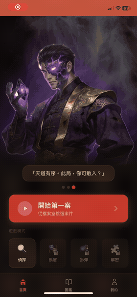
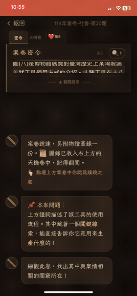
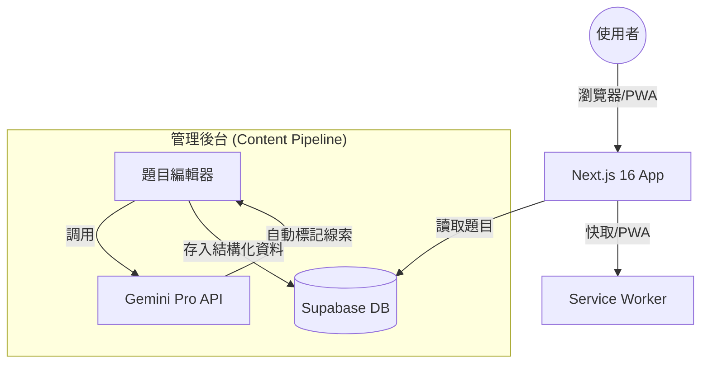

# 問題偵探 (Question Detective) — 互動學習轉型實驗

這是一個關於「重新想像學習」的實驗專案。目前的 Demo 內容以**國中社會科**為樣本，但底層引擎與編輯器設計上完全支援全學科擴充。

🔗 **[Live Demo](https://ed-tech-web-seven.vercel.app/?theme=guofeng)**

  

---

## 🎬 設計初衷：找回閱讀的快樂與深度

在接觸教育現場的過程中，我觀察到現代學生最缺的不是資料，而是「耐心」與「結構化思考」的能力。當考題敘述變長，學生往往會因為抓不到重點而感到挫折。

有沒有可能讓「解題」變得不再是壓力，而是一場有趣的推理旅行？

所以我試著把每一道考古題拆解成偵探遊戲的流程：

1. **收集線索** — 靜下心來，在題幹中找出隱藏的關鍵證據
2. **推理推導** — 將瑣碎的線索連結成邏輯鏈
3. **證據指認** — 建立「有幾分證據說幾分話」的思考習慣
4. **破案指認** — 最終選出答案，收穫成就感

---

## 🎮 核心玩法

這是經過多次學生實測後，反覆優化的核心解題流程：

  

> 從首頁沉浸式角色入場、線索收集、推理問答，到最終破案動畫，每個環節都在強化學生「找重點 → 建邏輯 → 舉證據」的思考習慣。

---

## 💡 設計理念：配置化大於寫死元件

所有的遊戲主題（國風・江湖、科幻・賽博、經典・偵探社）與未來的遊戲模式，都透過 Config 註冊與分離。新增科目或教學模組只需擴充 Config，不需改動核心引擎。

---

## 🛠️ 技術選型

| 層級 | 技術 | 原因 |
|------|------|------|
| 前端架構 | Next.js 16 (App Router) + React 19 | SSR + PWA 支援，移動端首屏快 |
| 型別安全 | TypeScript + Tailwind CSS v4 | 遊戲邏輯複雜，嚴謹型別防止邏輯錯誤 |
| 資料庫 | Supabase (PostgreSQL + JSONB) | 題目結構靈活，JSONB 不需預先固定 schema |
| AI 輔助 | Gemini API | 題目編輯器自動化線索標記與題幹切分，降低內容製作門檻 |
| 離線支援 | PWA (Service Worker) | 讓學生在任何網路環境都能穩定使用 |

---

## 📐 系統架構

---

## 📧 聯絡

對這個專案的實作細節或遊戲化教學有興趣，歡迎交流：`gurry0927@gmail.com`
